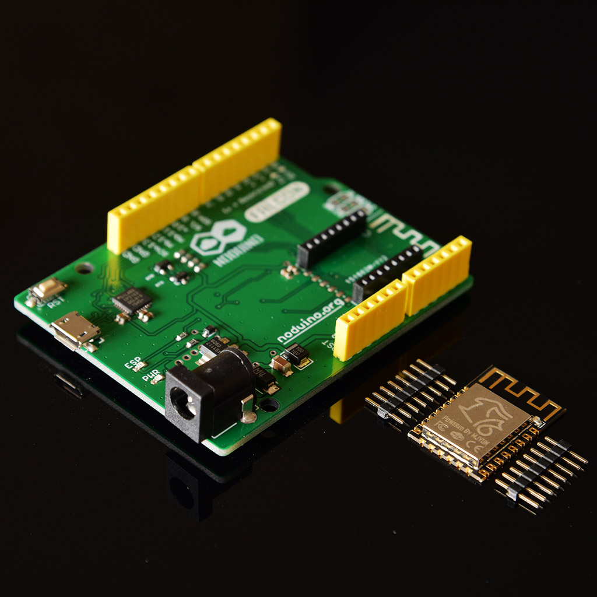
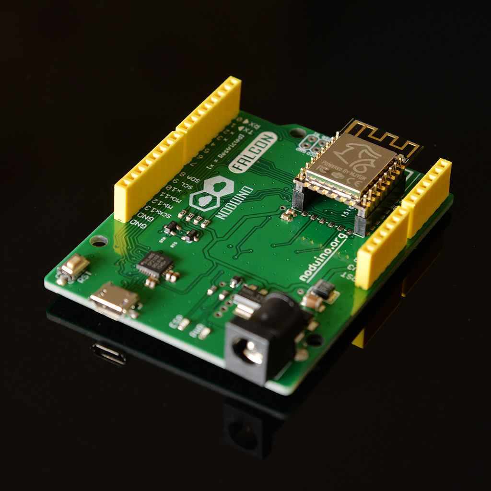
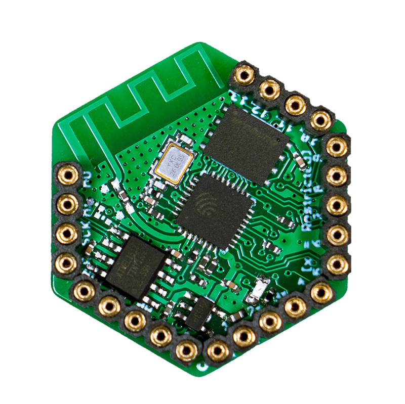

Noduino SDK
===========================================
[](https://travis-ci.org/icamgo/noduino-sdk) 


This is a Professional SDK developed by MaiKe Labs for ESP8266/ESP8285 WiFi SoC

This project brings support for ESP8266/ESP8285 chip to the professional embeded environment. It lets you write sketches using C language quickly, and run them directly on ESP8266, no external microcontroller required.

It has a lot of cool examples and reference sketches. You can make a smart IoT devices quickly based on these sketches.

It's based on Espressif SDK 1.5.4.1


Supported Boards
------------------

[*Falcon V1.0*](http://wiki.jackslab.org/Noduino)


[*Falcon V2.4*](http://wiki.jackslab.org/Noduino)







[*DDD V1.0*](http://wiki.jackslab.org/Noduino)




Quick Start
------------------

- Noduino Falcon board / NodeMCU v1.0 board
- Git

```bash
# clone the whole sdk
$ git clone --recursive git://github.com/icamgo/noduino-sdk.git noduino-sdk

# generate the toolchain (you need Python 2.7)
$ cd noduino-sdk/toolchain
$ ./gen.py

# try the first example
$ cd ../example/noduino/blink

# upload the example to dev board through serial
$ make flash
```

You can try other cool examples in example directory


Sketch Design
------------------

* [OpenPlug](sketch/open-plug/README.md) Open Smart Plug
* [OpenOnoff](sketch/open-onoff/README.md) Open Power Switch
* [OpenLight](sketch/open-light/README.md) Open Smart LED Lighting
* [OpenCurtain](sketch/open-curtain/README.md) Open Smart Curtain Control


Reference
------------------

* [Noduino](http://noduino.org)
* [Noduino WIKI](http://wiki.jackslab.org/Noduino)
