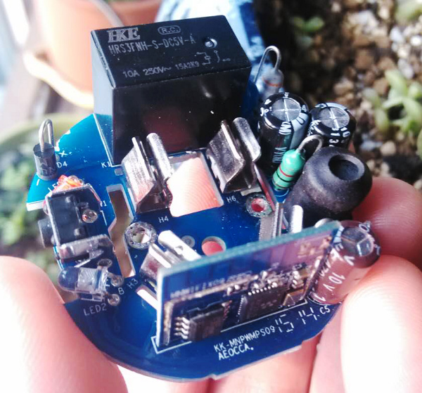
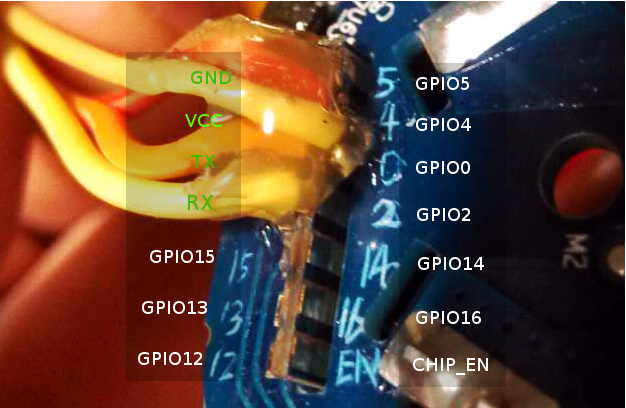
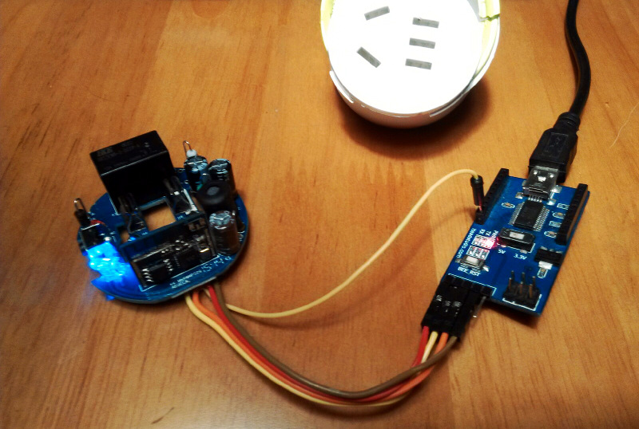

Small K mini Smart Plug Reference Firmware
===========================================

### Overview








### Pin Resource

Small K mini resource:

1. GPIO15 control the relay
2. GPIO12 related to the key (pull down, pressed is high)
3. GPIO3 (U0RX) control the blue LED
4. Red LED show the state of the relay (no related gpio)


### Build

```bash
$ make
```

Or make output more message:

```bash
$ make V=1
```

The target file is at build/ directory.


### Upload

Using a FT232RL USB to Serial Board, and connect:

* FT232_GND -----> minik_GND
* FT232_RXD -----> minik_TX
* FT232_TXD -----> minik_RX
* FT232_GND ------> minik_GPIO0

And then connect the 3.3V to power up the board:

* FT232_VCC3.3 ---> Plug_3.3V (Power supply must be 3.3V!)





```bash
$ make produce ESPPORT=/dev/ttyUSB0
```

It use the ```/dev/ttyUSB0``` serial device to upload the firmware into board.

You need to modify the varible ```ESPPORT``` according to your system in
Makefile. It should be /dev/cu.SLAB_USBtoUART in Mac OS X or COM3 in windows.


### Erase Flash

Enter flush mode and execute:

```bash
$ make erase
```

### Dump Flash

Enter flush mode and execute:

```bash
$ make dump
```

The flash.bin is the whole flash content


### Re-Init RF

Enter flush mode and execute:

```bash
$ make rfinit
```

It's override the rfinit data in flash using the esp_init_data_default.bin
in sdk1.4


### Show the memory usage

After building the firmware:

```bash
$ make mem
   Section|                   Description| Start (hex)|   End (hex)|Used space
------------------------------------------------------------------------------
      data|        Initialized Data (RAM)|    3FFE8000|    3FFE83B0|     944
    rodata|           ReadOnly Data (RAM)|    3FFE83B0|    3FFE9B54|    6052
       bss|      Uninitialized Data (RAM)|    3FFE9B60|    3FFF0B20|   28608
      lit4|     Uninitialized Data (IRAM)|    40107408|    40107408|       0
      text|          Uncached Code (IRAM)|    40100000|    40107408|   29704
irom0_text|             Cached Code (SPI)|    40240000|    40289AC8|  301768
------------------------------------------------------------------------------
Entry Point : 40100004 call_user_start()
Total Used RAM : 65308
Free IRam : 3064 or 19448 (option 48k IRAM)
Free Heap : 46316
Total Free RAM : 65764
```


### Clean the system parameter

If you want to clean the ssid and password stored in flash by SDK:

```bash
$ make sysclean
```


### Clean

```bash
$ make clean
```
